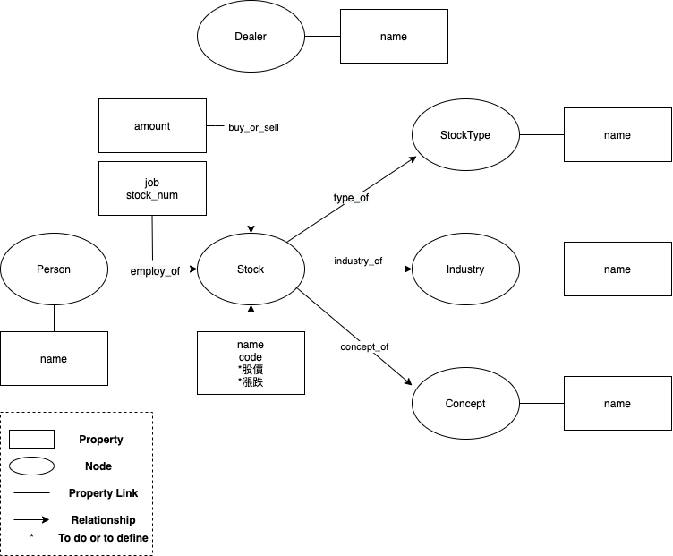
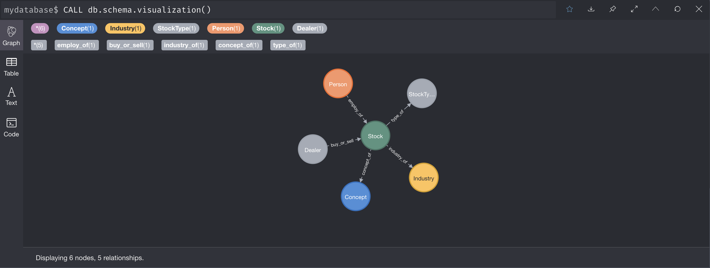
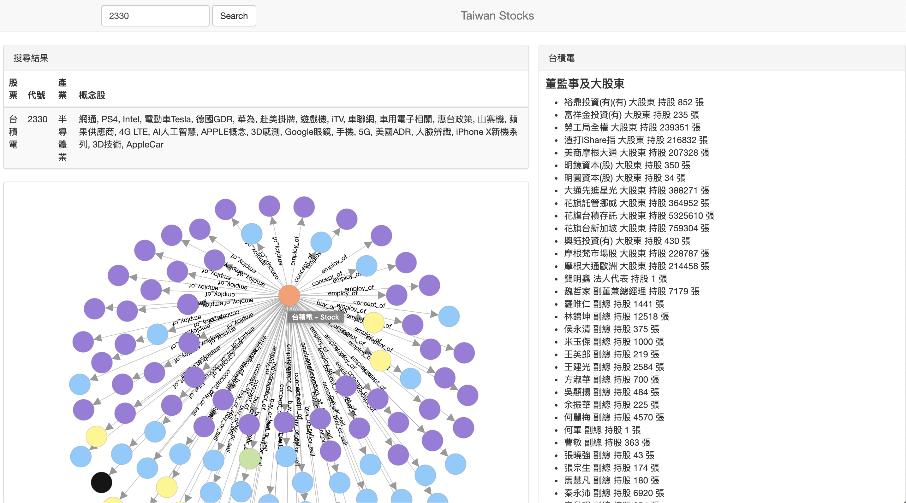

# Taiwan Stock Knowledge Graph

爬取公開資料集並使用Neo4j建構台灣股市的知識圖譜

公開資料集/相關股票套件有

- [twstock](https://github.com/mlouielu/twstock)
- [永豐金證券-董監持股](https://www.sinotrade.com.tw/Stock/Stock_3_1/Stock_3_1_6_2?ticker=)
- [Pchome股市概念股](https://pchome.megatime.com.tw/group/sto3)

Welcome to watch, star or fork.


---

## 實體關聯定義



目前定義有六種實體：
- **Person**表示董監，從[永豐金證券-董監持股](https://www.sinotrade.com.tw/Stock/Stock_3_1/Stock_3_1_6_2?ticker=)抽取出
- **Stock**所有證券的名字，代號，從[twstock](https://github.com/mlouielu/twstock)抽取出，屬性未來可能會加上股價、漲跌
- **StockType**表示股票、ETF、權證等等，從[twstock](https://github.com/mlouielu/twstock)抽取出
- **Industry**表示產業類別，如半導體業、航運業等等，從[twstock](https://github.com/mlouielu/twstock)抽取出
- **Concept**表示概念股，如台積電有多個概念股，如5G、APPLE概念股等等，從[Pchome股市概念股](https://pchome.megatime.com.tw/group/sto3)抽取出
- **Dealer**表示券商/主力得分點，如隔日沖券商 美林、元大-土城永寧、國票-敦北法人等等，從[永豐金證券-主力進出](https://www.sinotrade.com.tw/Stock/Stock_3_1/Stock_3_1_6_7?ticker=)抽取出

五種關聯:
- **employ_of**表示董監/大股東跟該股票的關係，屬性有職位以及持股張數，從[永豐金證券-董監持股](https://www.sinotrade.com.tw/Stock/Stock_3_1/Stock_3_1_6_2?ticker=)抽取出
- **type_of**表示該股票屬於何種類型
- **industry_of**表示該股票屬於何種行業
- **concept_of**表示該股票有哪些概念股
- **buy_or_sell**表示券商對該股票的買賣超，正值為買超，負值為賣超

查詢schema，啟動neo4j後
```cypher
CALL db.schema.visualization()
```



---

## 資料集建構

```bash
cd src
python get_stock_info.py
python get_executive.py
python get_concept_stock.py
python get_dealer.py
```


以上是建構初始資料集，Neo4j需要再針對以上資料集生成對應的格式，可以理解為上面實體關聯關係圖的所有實體關聯，我們都要為他們建立一個檔案，上面實體關聯總共有11種，所以要有11個檔案。對於格式要求可以參考 https://neo4j.com/docs/operations-manual/current/tutorial/neo4j-admin-import/


建立Neo4j可接受的格式：
```bash
cd src
python build_import_csv.py
```

檔案生成在`data/import`

---

## 使用Neo4j生成知識圖譜

### Installation
Version: Neo4j 4.2.2 

關於Neo4j的安裝啟動，建議直接從[官方文件](https://neo4j.com/docs/operations-manual/current/)閱讀起 

這裡提供快速教學

進入 https://neo4j.com/download-center/  去選版本或是 直接點 https://neo4j.com/download-thanks/?edition=community&release=4.2.2&flavour=unix

接著解壓縮
```bash
tar -xf neo4j-community-4.2.2-unix.tar.gz
```
擷取出來的資料夾為`$NEO4J_HOME`

執行neo4j
```bash
cd $NEO4J_HOME/bin
./neo4j console
```

我是用Mac，如果出現
Unable to find any JVMs matching version "11".
No Java runtime present, try --request to install.
參考 https://community.neo4j.com/t/unable-to-find-any-jvms-matching-version-11/18183/3

```bash
brew install openjdk@11
sudo ln -sfn /usr/local/opt/openjdk@11/libexec/openjdk.jdk /Library/Java/JavaVirtualMachines/openjdk-11.jdk
```

and then visit `http://localhost:7474`，接著更改預設密碼


### Neo4j Graph Data Science (GDS) 

安裝圖演算法套件

參考 https://neo4j.com/docs/graph-data-science/current/installation/

---

### 生成圖譜

```bash
cd $NEO4J_HOME/bin
./neo4j-admin import --id-type=STRING --database=mydatabase --nodes stock/person.csv --nodes stock/stock.csv --nodes stock/stock_type.csv --nodes stock/concept.csv --nodes stock/industry.csv --nodes stock/dealer.csv --relationships stock/person_stock.csv --relationships stock/stock_industry.csv --relationships stock/stock_concept.csv --relationships stock/stock_st.csv --relationships stock/dealer_stock.csv
```

`mydatabase`為我自己命名資料庫的名字，可以更改

目前上傳的資料集差不多是在2021/1/21前後的資訊，如果需要最新資訊可以回到[資料集建構](##資料集建構)，去爬下最新的資料。
**而券商進出的資訊是2021/3/10的資料**，未來預計補上券商在各日期的進出資訊。

**注意**，把`data/import`整個資料夾放到`$NEO4J_HOME/bin`裡，我自己是有再將資料夾重新命名為`stock`

---

## 使用Cypher於知識圖譜回答問題


套件需求
```bash
pip install python-igraph
pip install py2neo
```

### 問題

1. GG有多少副總在其他公司也是董監事經理人或大股東
1. GG有多少獨立董事
1. 有多少'電腦及週邊設備業'也是'AI概念股'
1. 列出寶寶所有零持股的副總
1. 寶寶副總有多少比例零持股
1. 寶寶副總有多少比例持股小於1000
1. 查詢跟最多股票有關係的前35位董事
1. 隔日沖券商 美林 買超張數超過1000張的股票

...等等

詳細請查看 `src/cypher_script.ipynb`

---

## Web Application



- Application Type: Python-Web Application
- Web framework: Flask (Micro-Webframework)
- Neo4j Database Connector: Neo4j Python Driver for Cypher Docs
- Database: Neo4j-Server (4.x)
- Frontend: jquery, bootstrap, d3.js

### Run locally
```bash
python run.py
```

### TODO

- [x] neo4j query的api
- [x] 前端graph的視覺化
- [x] 把前端頁面弄得更細緻


---

## 自定義視覺化
[neovis](https://github.com/neo4j-contrib/neovis.js)

執行neo4j後
```bash
cd $NEO4J_HOME/bin
./neo4j console
```

開啟`index.html`，記得把config改成自己的帳號密碼

這裡自定義的視覺化為使用graph algorithms，只畫出股票及董事之間的關係。
```bash
python run_graph_algo.py
```

Stock size為Stock與概念股的pagerank，color為Stock與概念股的community detection

Person size為Person與Stock的pagerank，color為Person與Stock的community detection

employ_of粗細為該董監持股數除以全部董監持股數


---

## Reference

- https://github.com/lemonhu/stock-knowledge-graph
- https://towardsdatascience.com/graph-analytics-with-py2neo-f629ba71051b
- https://github.com/neo4j-contrib/neovis.js
- https://medium.com/neo4j/graph-visualization-with-neo4j-using-neovis-js-a2ecaaa7c379
- https://www.lyonwj.com/blog/graph-of-thrones-neo4j-social-network-analysis
- https://stackoverflow.com/questions/23310114/how-to-reset-clear-delete-neo4j-database
- https://github.com/nicolewhite/neo4j-flask
- https://github.com/neo4j-examples/movies-python-bolt
- https://observablehq.com/@xianwu/force-directed-graph-network-graph-with-arrowheads-and-lab

---

## Acknowledgement
感謝[adsl8212](https://github.com/adsl8212)協助爬蟲與JS